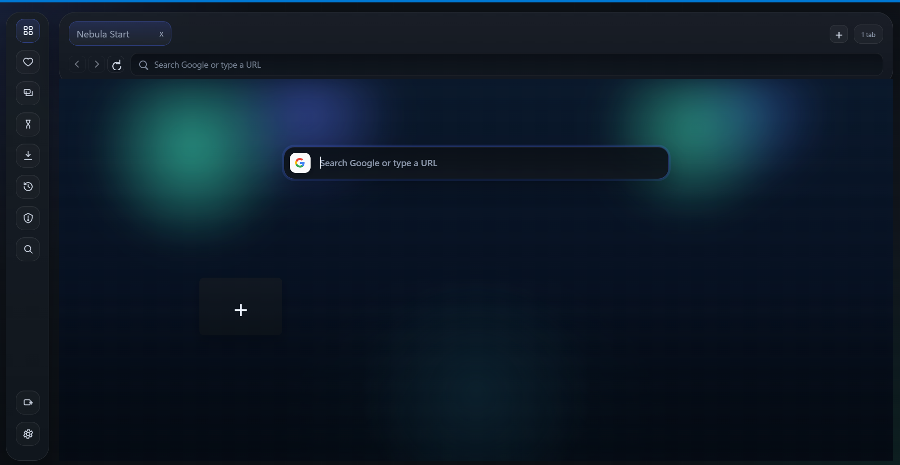
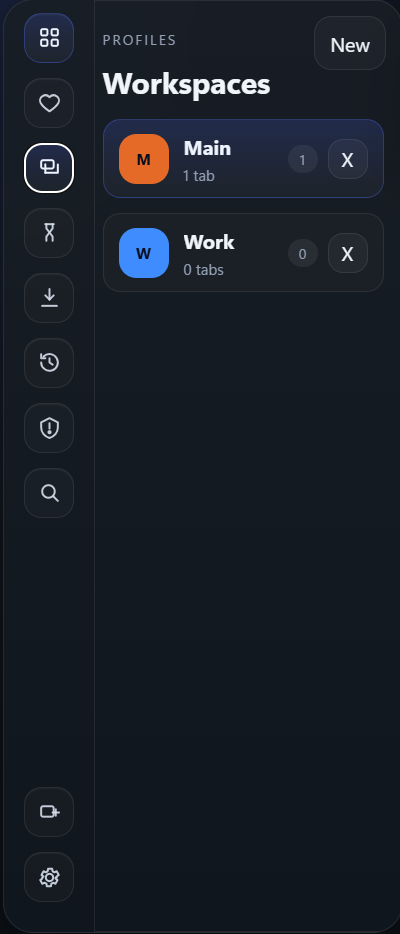
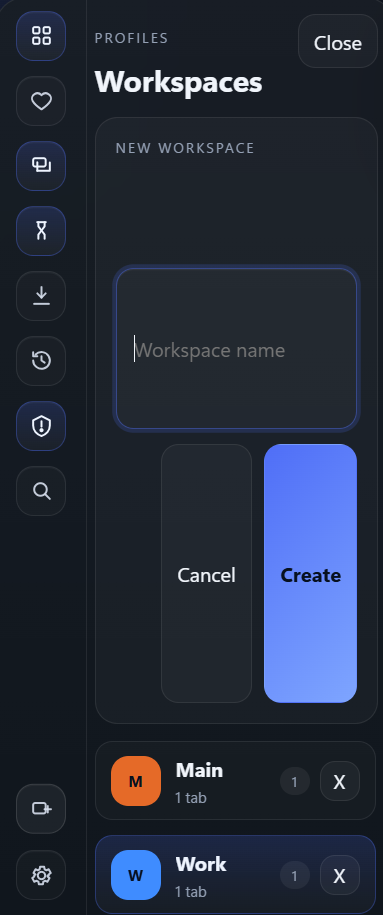
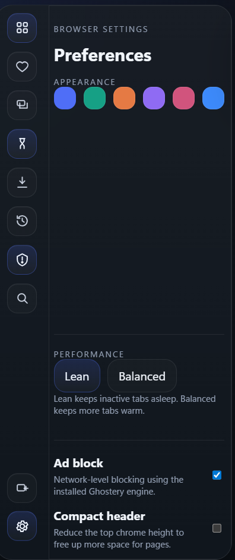

# Nebula

Nebula is a custom Chromium-based workspace browser shell for Windows, built with Electron.

It is designed as a practical multi-session browser shell rather than a starter app. The project focuses on isolated workspaces, a custom in-app browser chrome, download tracking, bookmarks, history, a speed-dial start page, and optional network-level ad blocking.

## Highlights

- Multi-workspace sessions with isolated cookies and storage
- Fast workspace switching from the rail or `Ctrl+1` through `Ctrl+9`
- Custom tab strip, command bar, and drawer-driven browser UI
- Bookmarks, download tracking, and per-workspace history
- Speed-dial start page with editable shortcuts
- Ghostery-based ad blocking integration
- Lean mode that hibernates background tabs to reduce memory usage
- Risky mode guardrails for downloads and external navigation
- Windows packaging flow for source-to-build desktop output

## Why This Project Exists

Nebula is an original browser shell built on top of Electron's Chromium runtime. It is not a wrapper around proprietary Brave, Shift, or Opera GX code. The goal is to explore a more opinionated desktop browser workspace model with clear session isolation and a custom productivity-oriented interface.

## Requirements

- Windows
- Node.js `20+`
- npm

## How To Run From Source

Install dependencies:

```powershell
npm.cmd install
```

Start Nebula in development mode:

```powershell
npm.cmd start
```

You can also use:

```powershell
npm.cmd run dev
```

## How To Compile / Build

Build a Windows desktop package from source:

```powershell
npm.cmd run build:win
```

This uses `scripts/build-win.js`, which packages the app with `@electron/packager`.

Build output is written to:

```text
release\
```

Typical output path:

```text
release\Nebula-win32-x64\Nebula.exe
```

If you want to rebuild cleanly, delete the old `release/` folder first and run:

```powershell
npm.cmd run build:win
```

## Screenshots

### Main UI



### Workspace Switching



### Create Workspace Flow



### Settings



## Project Structure

- `src/main/main.js`
  - Main process, BrowserWindow and BrowserView orchestration, session handling, downloads, history, bookmarks, ad-block integration, and security rules
- `src/preload/preload.js`
  - Hardened renderer bridge exposed as `window.nebula`
- `src/renderer/index.html`
  - Main shell UI
- `src/renderer/app.js`
  - Renderer state management and UI behavior
- `src/renderer/start.html`
  - Start page / speed dial surface
- `src/renderer/start.js`
  - Start page shortcut management
- `scripts/build-win.js`
  - Windows packaging script using `@electron/packager`

## Keyboard Shortcuts

- `Ctrl+T`
  - New tab
- `Ctrl+W`
  - Close active tab
- `Ctrl+L`
  - Focus address bar
- `Alt+Left`
  - Back
- `Alt+Right`
  - Forward
- `Ctrl+1` through `Ctrl+9`
  - Switch workspace
- `Ctrl+Alt+R`
  - Toggle risky mode

## Security and Behavior Notes

- Renderer code runs with `contextIsolation` enabled
- `nodeIntegration` is disabled in renderer surfaces
- `webviewTag` is disabled
- Permissions are denied by default
- External navigation is restricted and filtered
- Download opening is guarded for dangerous file types

## Current Status

Nebula is already a real working desktop app, but it is still an independent project under active iteration rather than a fully polished end-user browser release.

Current strengths:

- Real custom browser shell implementation
- Clear workspace/session model
- Functional bookmarks, downloads, history, and settings surfaces
- Good foundation for further desktop product work

Current gaps:

- No automated tests yet
- No installer pipeline yet
- No app icons or branded release assets yet
- No Linux/macOS packaging workflow yet

## Legal Note

This repository contains original application code built on top of Electron and open-source dependencies. Respect the licenses of all dependencies and any websites or content you access with the app.

## License

MIT
